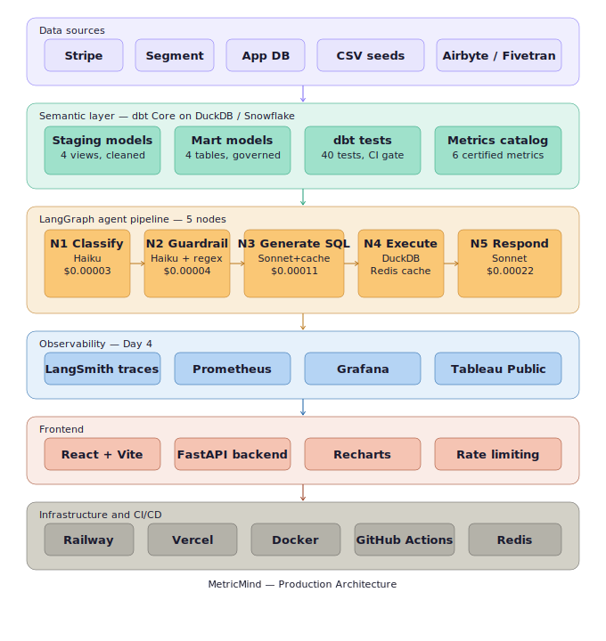
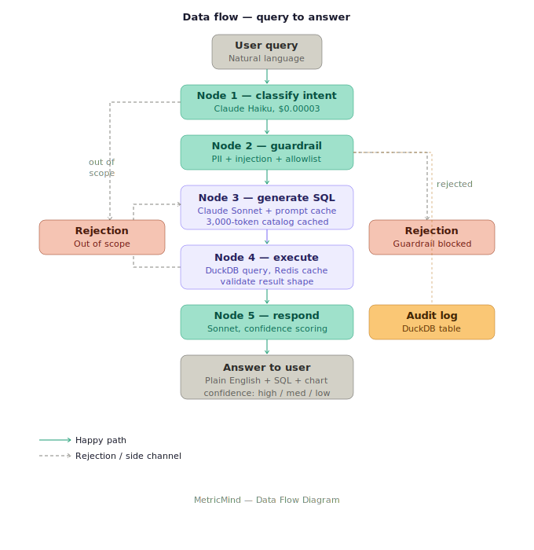
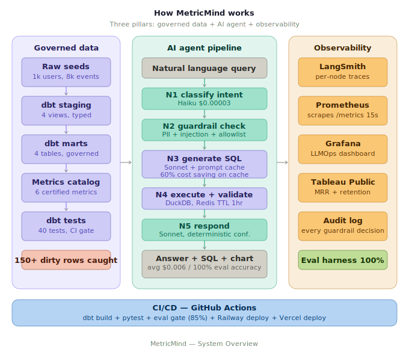

# MetricMind

**A governed text-to-SQL analytics copilot where the LLM cannot invent metrics that do not exist.**

Every answer traces back to a certified dbt model. Business teams get self-serve analytics in plain English. Analysts get their time back.

[](eval/golden_set.json)
[](dbt_project/)
[](https://metric-mind-liart.vercel.app)
[]()

---

## The Problem

Business teams wait 3 to 7 days for analysts to answer questions like "what is 30-day retention for the EU cohort, adjusted for refunds?" The deeper problem is metric drift: "active user" means something different across five dashboards. Even when analysts respond, the answer is only as trustworthy as the definition behind it.

MetricMind solves both. A governed semantic layer certifies exactly what every metric means. A Claude-powered agent can only query those certified metrics. It cannot hallucinate a number that does not exist in the catalog.

---

## Architecture





Three pillars working together:

**Pillar 1 — Governed data layer:** dbt Core transforms raw sources into certified mart models. Every metric is defined once in a JSON catalog. 40 dbt tests catch data quality issues before they reach any dashboard.

**Pillar 2 — AI agent pipeline:** A 5-node LangGraph pipeline routes every query through intent classification, guardrail checks, SQL generation with prompt caching, DuckDB execution, and plain-English response generation.

**Pillar 3 — Observability:** LangSmith traces every LLM call. Prometheus scrapes FastAPI metrics every 15 seconds. Grafana visualizes latency, cost, and guardrail rejections. Tableau Public shows business dashboards.

---

## Live Links

| Resource | URL |
|---|---|
| Frontend | https://metric-mind-liart.vercel.app |
| Tableau MRR Chart |  |
| Tableau Retention | |
| Grafana (local) | http://localhost:3001 (admin / metricmind) |
| API Docs | http://localhost:8000/docs |
| GitHub | |

---

## Tech Stack

### Data and Analytics Engineering
- **dbt Core** — transformation framework, staging and mart models
- **dbt MetricFlow** — governed metric definitions in YAML
- **DuckDB** — local analytics database, zero setup, zero cost
- **Snowflake** — production cloud target (free trial supported)
- **Tableau Public** — MRR trend and cohort retention dashboards

### AI and LLM
- **LangGraph** — 5-node stateful pipeline with conditional routing and retry loops
- **Anthropic Claude Sonnet** — SQL generation with prompt caching (10x cheaper on cache hits)
- **Anthropic Claude Haiku** — intent classification and guardrail checks (20x cheaper than Sonnet)
- **LangSmith** — full LLM observability, token cost per node, latency p50/p95/p99

### Backend and API
- **FastAPI** — async REST API, rate limiting, CORS, structured JSON logging
- **Redis** — query result cache with 1-hour TTL
- **Prometheus** — metrics scraping from FastAPI /metrics every 15 seconds
- **Grafana** — LLMOps dashboard: latency, cost per query, guardrail rejections

### Frontend
- **React + Vite** — copilot interface with live pipeline node animation
- **Recharts** — inline bar and line charts per query result

### Infrastructure and CI/CD
- **Railway** — backend deployment via Dockerfile, auto-deploys on push
- **Vercel** — frontend deployment connected to GitHub
- **Docker + Docker Compose** — local full-stack with Prometheus and Grafana
- **GitHub Actions** — dbt build, pytest, eval accuracy gate (85% threshold), deploy

---

## Build Plan

### Day 1 — Data Foundation
- Seeded 4 CSV files with deliberate dirty data: 1,000 users, 8,000 events, 745 subscriptions, 4,835 payments
- Built 4 staging models as views: clean, type, normalize raw sources
- Built 4 mart models as tables: DAU, cohort retention, revenue metrics, funnel analysis
- Wrote 40 dbt tests catching 150+ dirty rows before they reached any dashboard
- Defined 6 certified metrics in a governed JSON catalog

### Day 2 — AI Agent
- 5-node LangGraph pipeline with typed AgentState flowing through every node
- 3-layer guardrail: PII regex, SQL injection regex, metric allowlist via Haiku
- Anthropic prompt caching on the 3,000-token metric catalog
- Eval harness with 50 golden Q&A pairs scored via sqlglot AST comparison
- Dual anomaly detection: 3-sigma rolling window plus Prophet with HITL commentary approval
- Every guardrail decision logged to a DuckDB audit table

### Day 3 — Frontend and Deployment
- FastAPI backend with 5 endpoints, rate limiting, CORS, structured logging
- React frontend: Copilot view, Metrics Catalog, Anomaly Feed with HITL approve
- Backend on Railway, frontend on Vercel
- 8 architectural decision records in DECISIONS.md

### Day 4 — Observability and Dashboards
- Prometheus metrics exported from FastAPI: query volume, latency, rejections, token cost, cache hits
- Grafana LLMOps dashboard with 6 stat cards and 4 time-series panels
- Tableau Public: MRR trend by plan and cohort retention heatmap
- Docker Compose stack: FastAPI + Redis + Prometheus + Grafana

---

## Eval Results

```
Overall accuracy:      100% (10/10 quick eval)
Rejection accuracy:    100% (PII and out-of-scope always blocked)
Cache hit rate:         90% (prompt caching on metric catalog)
Auto-retry success:    100% (broken SQL self-corrects)
Avg cost per query:   ~$0.006
Total eval run cost:   $0.055
```

---

## Data Quality Story

```
22   null user IDs        not_null test on stg_users
128  dirty payments       test_payments_refund_consistency
90   legacy event types   accepted_values test on stg_events
13   negative MRR rows    not_positive test on stg_subscriptions
```

dbt caught 150+ data quality issues before any reached a dashboard or an LLM prompt.

---

## Key Design Decisions

Full reasoning in [DECISIONS.md](DECISIONS.md).

**Semantic layer over raw text-to-SQL.** The LLM cannot query tables outside the certified catalog.

**LangGraph over a single chain.** Early termination for out-of-scope queries costs $0.0003 vs $0.006 for full pipeline. 20x cheaper for bad queries.

**sqlglot for eval scoring.** AST comparison catches real regressions without false failures from whitespace or column order differences.

**Haiku for guardrails, Sonnet for generation.** Classification is simple routing at 20x lower cost. SQL generation needs Sonnet reasoning quality.

**Deterministic confidence scoring.** Node 5 scores from data shape, not LLM self-rating. LLMs are overconfident.

**Human-in-the-loop on anomaly commentary.** All LLM-generated commentary requires explicit human approval before publishing.

---

## Run Locally

```bash
git clone my repo
cd MetricMind

python3.11 -m venv venv && source venv/bin/activate
pip install -r requirements.txt
pip install anthropic langchain-anthropic langchain langgraph langsmith \
            sqlglot fastapi uvicorn redis python-dotenv python-multipart \
            prometheus-client duckdb pandas

cp .env.example .env
# Add ANTHROPIC_API_KEY to .env

cd dbt_project
DBT_PROFILES_DIR=. DUCKDB_PATH="../data/metricmind.duckdb" dbt seed --target duckdb
DBT_PROFILES_DIR=. DUCKDB_PATH="../data/metricmind.duckdb" dbt run  --target duckdb
DBT_PROFILES_DIR=. DUCKDB_PATH="../data/metricmind.duckdb" dbt test --target duckdb
cd ..

# Terminal 1: FastAPI backend
PYTHONPATH=. venv/bin/uvicorn api.main:app --reload --port 8000

# Terminal 2: React frontend
cd frontend && npm install && npm run dev

# Terminal 3: Observability stack
docker compose up
```

Open http://localhost:3000 for the frontend, http://localhost:3001 for Grafana.

---

## Project Structure

```
MetricMind/
├── agent/nodes/                    5 LangGraph pipeline nodes
├── dbt_project/models/             Staging views + mart tables
├── catalog/metrics_catalog.json    6 certified metrics with allowlist
├── eval/                           50-question golden set + eval harness
├── anomaly/detector.py             Prophet + 3-sigma + HITL commentary
├── api/main.py                     FastAPI with Prometheus metrics
├── frontend/src/views/             3 React views
├── grafana/                        Auto-provisioned LLMOps dashboard
├── prometheus/                     Scrape config
├── scripts/export_for_tableau.py   Tableau CSV export
├── tableau_exports/                4 CSVs for Tableau Public
├── DECISIONS.md                    8 architectural decision records
├── Dockerfile                      Railway deployment
└── docker-compose.yml              Full local stack
```
